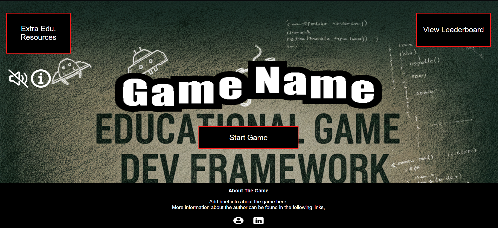
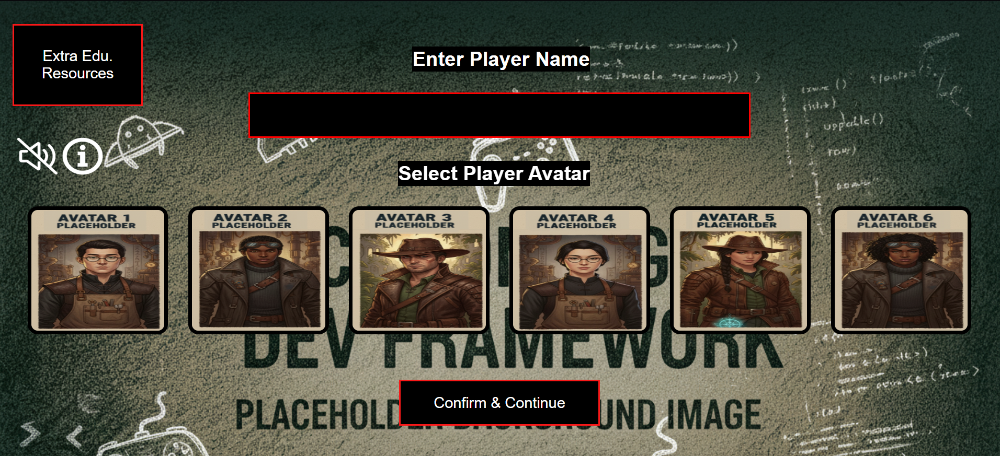
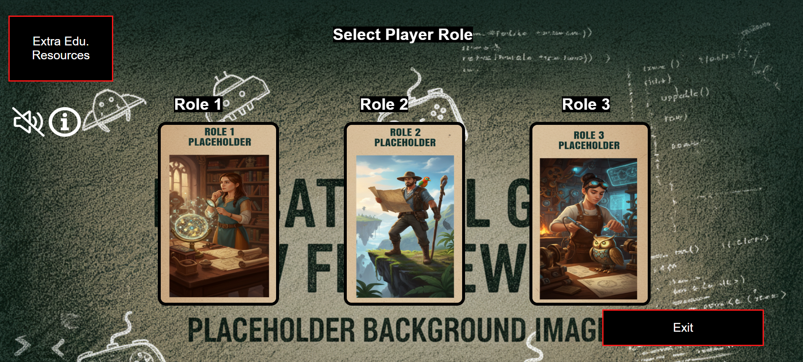
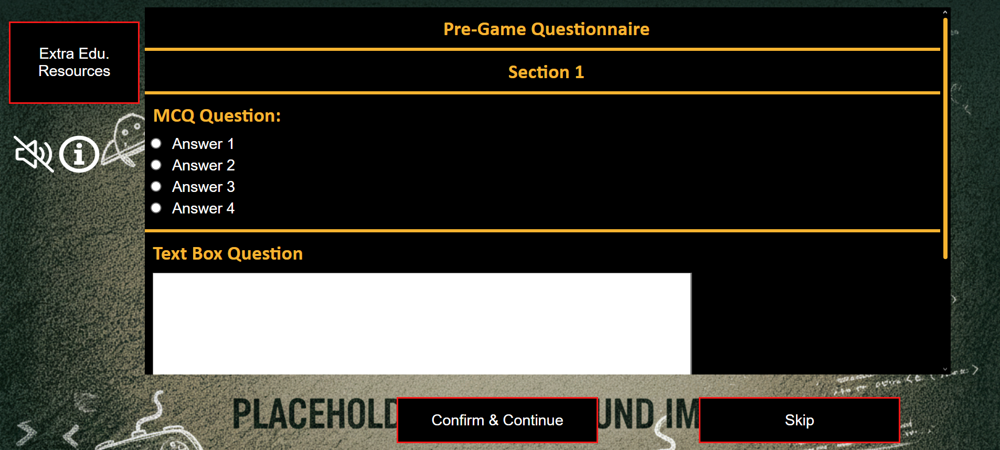
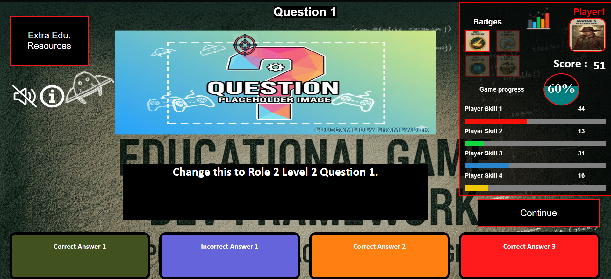
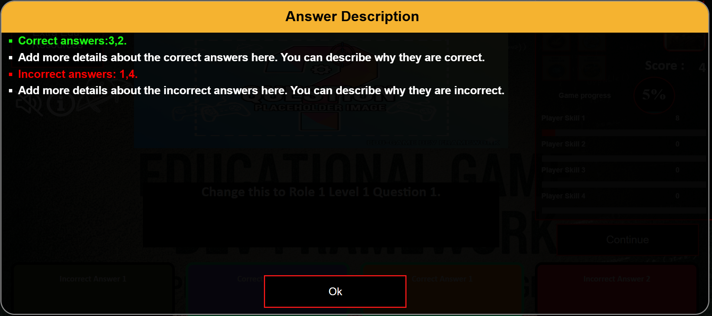
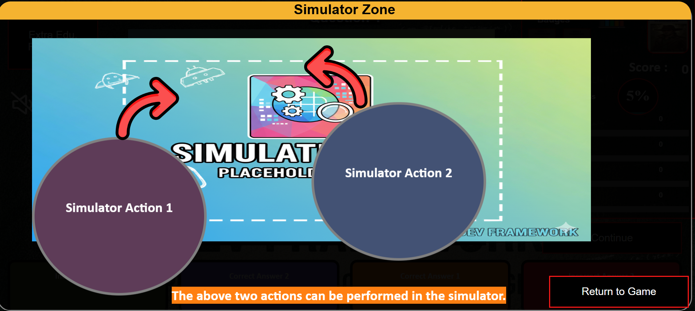
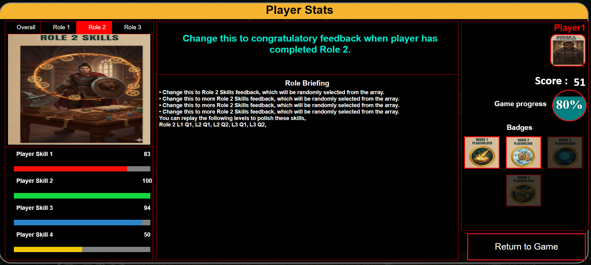
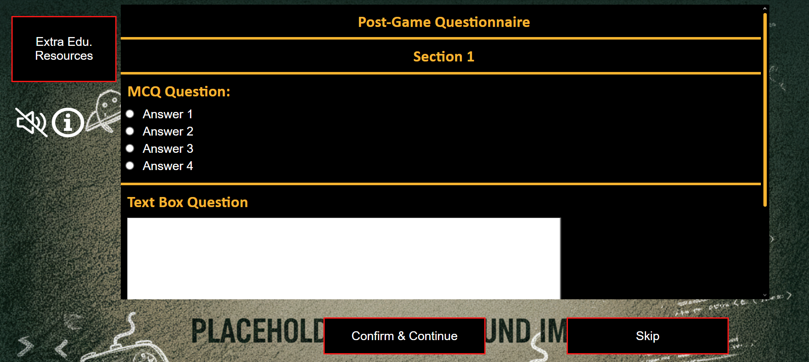
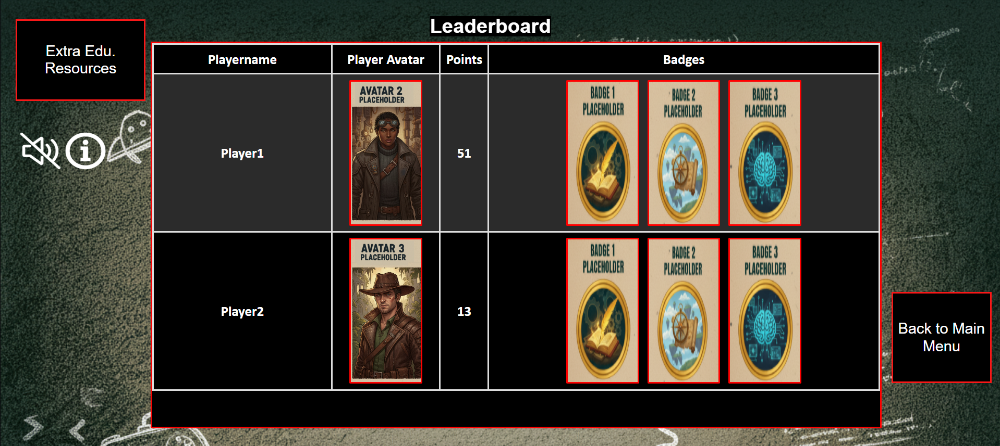

# Educational Game Development Framework 

**Framework for Developing Web-Based Educational Games with Multi-Opposing-Role Gameplay, Simulations, and In-Game Feedback**

[](LICENSE)

---

## Overview

This is a **web-based framework** designed to simplify the creation of educational games that teach technical concepts using engaging gameplay mechanics, based on **The XSS Game (https://github.com/darkcyberwizard/TheXSSGame)**.

The framework supports:

- **Multi-opposing-role gameplay**: Easily implement different roles to create competitive and collaborative scenarios. For instance, **Attacker**, **Defender**, and **User** could be used for a Cybersecurity educational game.
- **Interactive narrative-based simulations**: Build real-world inspired challenges to teach concepts in a safe and controlled environment.  
- **In-game feedback**: Integrate **Player Statboards**, badges, and multiple feedback types (confirmatory, explanatory, affirming, personalized) to motivate learners and reinforce learning.  

The framework runs fully in the browser — no server-side dependencies are required. It provides reusable components, templates, and utilities to accelerate the development of educational games.

---


## Folder Structure

```

TheXSSGame/
├── images/	     # Images used in the game
├── music/           # Background music and sound effects
├── scripts/         # JavaScript files for game logic
├── gdpr.html        # GDPR compliance and privacy information
├── index.html       # Main HTML file to launch the game
├── style.css        # Main CSS file for styling
├── README.md        # Project README
└── ATTRIBUTIONS.md  # Icon, sound, and library attributions

````

---
## Screenshots

Here are some example screenshots from the game dev framework:

**Start Menu**  
  
The initial screen where players can start the game, select options, and view instructions.

**Player Name & Avatar Selection**  
  
Players can choose their in-game name and avatar before starting.

**Player Role Selection**  
  
Select your role: Role 1, Role 2, or Role 3.

**Pre-Game Survey**  
  
Players answer a brief survey to capture demographics and prior knowledge.

**Gameplay**  
  
Interactive challenges with dynamic scenarios.

**Answer Description**  
  
Detailed feedback can be provided after each challenge to explain correct answers.

**Simulation Zone**  
  
A safe environment to test scenarios and learn from simulations.

**Player Statboard**  
  
Track points, badges, progress and receive feedback in real-time.

**Post-Game Survey**  
  
Survey to assess knowledge gained and gather feedback from players.

**Leaderboard**  
  
Leaderboard with player score and badges ranked according to player score.

---

## Features

The framework includes pre-built modules for:

1. **Role-based gameplay**: Easily define multiple roles with unique objectives and interactions.  
2. **Simulation engine**: Script interactive challenges and branching narratives.  
3. **Feedback and statboards**: Implement multiple types of in-game feedback (affirming, explanatory, confirmatory, personalized) and track learner progress with badges, scores, and leaderboards.  
4. **Surveys and assessment**: Built-in support for pre- and post-game surveys to capture learner knowledge and motivation.  
5. **Extensibility**: Modular design allows developers to extend gameplay mechanics, feedback types, and analytics components.  

---

## Getting Started

To start using **EduGameDevFramework**:

1. **Clone the repository:**

```bash
git clone https://github.com/darkcyberwizard/EduGameDevFramework.git
````

Or download as a ZIP and extract.

2. **Open the demo:**

* Navigate to the framework folder
* Open `index.html` in a modern web browser

> ⚠️ No additional setup is required. The framework runs fully in the browser.

---

## Usage

* Use the provided modules to implement roles, simulations, feedback, and surveys.
* Customize components to fit your educational objectives and learning scenarios.
* Integrate the framework into your own educational game projects with minimal coding effort.

---

## Citation

Please cite if used in research or coursework:

### BibTeX

```bibtex
@article{Weeratunge_2025,
  title={Enhancing Cybersecurity Education Through Multi-Opposing-Role Gameplay and Simulations},
  volume={19},
  ISSN={2049-0992},
  url={http://dx.doi.org/10.34190/ecgbl.19.2.3993},
  DOI={10.34190/ecgbl.19.2.3993},
  number={2},
  journal={European Conference on Games Based Learning},
  publisher={Academic Conferences International Ltd},
  author={Weeratunge, Nipuna Hiranya and Hjelsvold, Rune},
  year={2025},
  month=sep,
  pages={873–882}
}

@article{Weeratunge_2025b,
  title={Enhancing Cybersecurity Learning with In-Game Feedback},
  volume={19},
  ISSN={2049-0992},
  url={http://dx.doi.org/10.34190/ecgbl.19.2.3994},
  DOI={10.34190/ecgbl.19.2.3994},
  number={2},
  journal={European Conference on Games Based Learning},
  publisher={Academic Conferences International Ltd},
  author={Weeratunge, Nipuna Hiranya and Hjelsvold, Rune},
  year={2025},
  month=sep,
  pages={883–891}
}
```

---

## License

This project is licensed under the **MIT License** – see [LICENSE](LICENSE) for details.

---

## Contact

* **Nipuna H. Weeratunge** – [GitHub](https://github.com/darkcyberwizard) | [Email](mailto:nipuna.h.weeratunge@gmail.com)

---

Enjoy developing engaging educational games! 🚀


